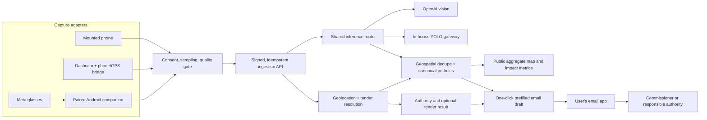

# Scalable capture, inference, and email complaint routing

Checked against the linked vendor and government material on 11 September 2026.

## Product boundary

Pothole Reporter should expose one stable observation contract while allowing the
capture device and shared detector to change independently.
"Shared" describes who operates the inference service, not which model is behind it.

- **Personal vision:** a person may continue to send selected images directly to
  OpenAI using their own key. The project server receives only accepted observation
  metadata needed for deduplication, tender lookup, the public map, and impact counts.
- **Sponsored shared vision:** the project server pays for and selects the detector.
  It uses OpenAI image input today and can move detection to an in-house, fine-tuned
  YOLO gateway without requiring an app upgrade.
- **Complaint filing:** the only filing path is a user-controlled, one-click email
  draft routed to the commissioner or responsible authority. There is no automatic
  government webhook, grievance-portal submission, or server-side complaint delivery.

OpenAI is not a free model service. The accurate product wording is **centrally
sponsored shared vision inference, subject to server capacity and credits**. OpenAI's
Responses API accepts image inputs and structured output, which is why it can satisfy
the current normalized detector contract. See the
[official OpenAI Responses API reference](https://developers.openai.com/api/reference/cli/resources/responses/methods/create).

## Target data flow



The production-scale version should put a queue between ingestion and expensive
inference. The current synchronous API remains useful for individual phone captures;
dashcam fleets need asynchronous admission, backpressure, retries, and a job-status
endpoint rather than holding one HTTP request open for an entire video.

## Capture-device support

The current release implements phone capture plus recorded-video import. A person can
select multiple clips from Android's media/file picker, or share a clip into Pothole
Reporter from Photos, Files, or a dashcam companion app. Android keeps a
persisted content URI for picked media and samples frames natively; the browser retains
a foreground-only HTML decoder fallback for short clips. Direct live Meta camera access
remains a separate developer-preview pilot, not a public feature.

| Source | Feasibility | Required adapter | Important limit |
|---|---|---|---|
| Android phone | Supported now | Existing WebView/CameraX paths | Must be safely mounted; each scheduled sample captures and uploads exactly one frame. |
| Dashcam recording | Common files supported now | Android media/file picker, direct Android share target, native frame sampler, optional timestamped GPX | Codec/profile and GPS telemetry vary by vendor; H.264 MP4 is the safest interchange format and proprietary telemetry is not guessed. |
| Recorded Ray-Ban Meta / Meta AI clip | Supported now | Import to the phone with Meta AI, then pick or share the clip | The clip has no assumed per-frame GPS; add a timed track or analyse without routing. |
| Live Ray-Ban Meta camera | Pilot only | Meta Wearables Device Access Toolkit in the Android companion app | Developer Preview is not a generally publishable integration; see below. |

Every adapter should eventually produce the same versioned envelope:

```json
{
  "schema_version": 1,
  "client_event_id": "stable-id-for-retries",
  "source": {"device_class": "phone|dashcam|meta_glasses", "session_id": "..."},
  "captured_at_ms": 0,
  "location": {"lat": 0, "lng": 0, "accuracy_m": 0, "heading_deg": 0},
  "images": [{"role": "road_view", "data_url": "data:image/jpeg;base64,..."}],
  "consent_version": "..."
}
```

Each inference event contains exactly one selected road image. The public endpoint does
not accept an arbitrary remote video URL or a complete video upload. Picked videos stay
behind a persisted Android content URI and are sampled locally. Only downscaled JPEG
frames enter the existing signed detector/report flow. Clips received through another
app's temporary Share grant may need a bounded app-private cache copy; partial/expired
copies are deleted and oversized shares direct the user to the picker instead.

Imported route location is deliberately fail-closed. A timestamped GPX track can provide
per-frame coordinates when its time range aligns with trustworthy recording timestamps.
The user may explicitly apply the current phone position only to footage recorded at that
one location. With neither source, damage can still be detected and kept locally, but the
app does not invent a coordinate, contractor, tender, map point, or complaint recipient.

## Shared inference migration

The client should continue to call `POST /v1/vision/detect` and consume the existing
road-damage schema regardless of the selected shared engine.

1. **Today — OpenAI:** classify one selected road image per request. Keep `store: false`,
   request IDs, quotas, and explicit credit failures.
   The implemented `openai_then_http_yolo` server mode can fall back to the versioned
   AWS gateway only for a documented non-retryable OpenAI credit/spend/usage exhaustion
   code. It deliberately does not switch models for ordinary rate limits, timeouts,
   authentication errors, malformed output, or upstream 5xx responses.
2. **Shadow phase — YOLO:** send a sampled subset to YOLO without changing the user
   verdict. Compare precision, recall, false-positive categories, device type, light,
   rain, speed, and road position against human labels.
3. **Gated rollout:** use YOLO for high-confidence road-damage candidates; send
   ambiguous cases to a vision-language model or human review.
4. **Primary phase:** make YOLO the shared default only after the held-out benchmark
   meets the agreed recall and precision thresholds. Keep an explicit fallback switch.

A detector gateway must return the complete normalized five-field schema, its
engine/model version, inference latency, and evidence count. The fields are
`image_quality` (`acceptable|rejected`), `assessment` (`damaged|undamaged`), nullable
`damage_type`, nullable `size`, and `description`. Asphalt, concrete, gravel, dirt, and
mud roads are in scope, and damage at the road edge still counts as road damage. A bare
YOLO bounding box is not enough to assert road ownership or tender responsibility;
those remain separate decisions.

The reproducible, human-audited training/release path is in
[`ml/yolo/`](../ml/yolo/README.md). The low-idle-cost AWS Lambda/ONNX gateway and its
atomic request plus estimated-compute admission caps are in
[`infra/aws-yolo/`](../infra/aws-yolo/README.md). Neither is enabled by the checked-in
production defaults until a held-out release and real endpoint exist.

Low running cost comes primarily from doing quality checks and sparse sampling on the
device, rejecting near-identical frames, batching GPU work, and uploading event images
instead of continuous video. Self-hosted inference still has GPU, bandwidth,
observability, and operations cost.

## Email complaint contract

The official GBA site currently links to
[Sahaaya 2.0 public grievances](https://bbmp.gov.in/), but no public server-to-server
complaint ingestion or status-webhook contract was located. GBA's public privacy policy
mentions government APIs and integration in general; that is not authorization to post
citizen complaints to an undocumented endpoint.

The app therefore uses email as its sole complaint action. One click opens a draft in
the user's email app with the recipient selected from the jurisdiction/authority
registry. The draft carries the detected location and map link, pothole classification,
size and description, and the selected evidence photo. It adds a probable tender number
only when tender resolution returned a match; no placeholder or "not found" tender text
is inserted when there is no match. The user can review or edit the draft and explicitly
presses Send. Creating a central map record never claims that an official complaint was
filed.

The Worker does not store complaint text, photos, or email delivery state and has no
automatic GBA/BBMP/Sahaaya connector. See the
[government complaint boundary](GBA_INTEGRATION.md) for the evidence behind that choice.

## Meta glasses feasibility

**Technically yes for a controlled Android pilot. Not yet a general-production promise.**

Meta's Device Access Toolkit supports video streaming and photo capture from Ray-Ban
Meta Gen 1 and Gen 2 into an Android/iOS mobile application. Meta also permits local or
cloud/edge processing, but the glasses must be paired through the Meta AI app. See
[Meta's Wearables FAQ](https://developers.meta.com/wearables/faq/) and the
[official Android SDK repository](https://github.com/facebook/meta-wearables-dat-android).
On Android, the published stream choices are portrait 720×1280, 504×896, or 360×640 at
2, 7, 15, 24, or 30 FPS; Meta notes that lower settings generally improve per-frame
quality over Bluetooth. See the
[official camera-streaming guide](https://github.com/facebook/meta-wearables-dat-android/blob/main/plugins/mwdat-android/skills/camera-streaming/SKILL.md).

For a public release, the practical route today is to import a recorded clip. Meta says a
capture stays on the glasses until the user transfers it with Meta AI, after which it is
stored in the phone's photo roll like other media. Pothole Reporter can then receive it
through the Android picker or share sheet without linking a Meta account or embedding a
Meta SDK. See [Meta's capture/privacy explanation](https://www.meta.com/actions/responsible-innovation/).

For a controlled live-camera pilot, the later route is:

1. stream low-rate frames from the glasses to the paired Android app;
2. timestamp them against Android Fused Location (do not claim glasses-native GPS);
3. crop/quality-filter locally and send only candidate frames through the normal
   signed Pothole Reporter API;
4. use the phone UI for start/stop, with optional audio cues for confirmation.

Meta's Android sample demonstrates background recording with a foreground service, but
Bluetooth loss, folded/removed glasses, another camera experience, permissions, battery,
or thermal limits can still stop a session. Third-party voice invocation and Wi-Fi Direct
were still described as under development, so the first version should be a user-started
trip—not an always-on or direct-glasses-to-server system. See Meta's
[camera sample](https://github.com/facebook/meta-wearables-dat-android/tree/main/samples/CameraAccess)
and [April 2026 toolkit update](https://developers.meta.com/blog/explore-whats-possible-with-wearables-device-access-toolkit/).

Distribution is the larger blocker. Meta currently labels the toolkit Developer Preview;
open publishing is unavailable and Device Access Toolkit release channels currently
support at most 100 testers. See Meta's
[Developer Preview announcement](https://developers.meta.com/blog/build-for-display-glasses/).
Ray-Ban Meta hardware is
[officially sold in India](https://about.fb.com/news/2025/05/ray-ban-meta-glasses-come-to-india-experience-the-future-with-meta-ai-integrated-and-multiple-styles-on-offer/),
but the current [toolkit-linked supported-country list](https://www.meta.com/help/ai-glasses/4961066940605960/)
omits India. Validate Developer Center registration and an actual Indian-account/device
pairing before promising an Indian pilot.

Finally, eye-level portrait footage is materially different from a downward-facing
phone or dashcam. Train and evaluate on real glasses footage, especially lower-frame
road coverage, head motion, blur, night scenes, rain, and occlusion. The glasses' visible
capture indicator ([Meta's privacy explanation](https://www.meta.com/ai-glasses/camera-capture-photo-video/)),
explicit trip consent, bystander privacy, and short retention must be
part of the product—not deferred deployment details.

## Scale checkpoints

- **Pilot:** current Worker + D1, sponsored OpenAI, phone capture, and routed email drafts.
- **City beta:** queue-backed inference, short-lived object storage, YOLO shadow traffic,
  device/source metrics, and audited commissioner/authority email routing.
- **Fleet scale:** autoscaled GPU workers, H3/PostGIS geospatial indexing, partitioned
  event storage, per-tenant quotas, and robust tender/jurisdiction refresh jobs.
- **Wearables:** Meta release-channel pilot only after Indian entitlement, device-specific
  accuracy, thermal, battery, and privacy tests pass.

The public map should continue to show canonical defect locations and aggregate
sightings without a repair/fixed lifecycle, not a raw trail of where a person drove or
looked. Impact metrics should remain aggregate and must not turn the pseudonymous
installation ID into a user profile.
